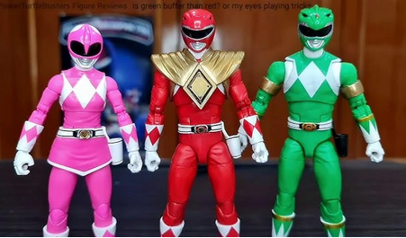

# CPE393: Introduction to Data Science with Python
**Final Group Project - Summer Semester 2026** 

**Team:** WaterRangers



---

## Installation & Setup

You can run this project using either **Google Colab** (cloud-based) or a **Local Environment** (using your favorite IDE and Jupyter Notebook). Choose the method that suits you best.

### Option 1: Using Google Colab (Recommended)
This is the easiest way to run the notebook without installing anything on your local machine.

1. Open your browser and go to [Google Colab](https://colab.research.google.com/).
2. In the popup window, select the **GitHub** tab.
3. Paste the following repository link: 
   `https://github.com/nikor3/WaterRangers`
4. Select the `main` branch.
5. Click on the `projet_notebook.ipynb` file to open and execute it.

---

### Option 2: Using a Local Environment
If you prefer to run the project locally, please follow these steps.

#### Prerequisites
- **Python version:** `Python 3.12.3`
- Verify your Python version in your terminal:
  ```bash
  python --version
  ```
  Or
  ```bash
  python3 --version
  ```

#### Create a Virtual Environment

Navigate to the project folder in your terminal and create a virtual environment named .venv:
Bash

```bash
python -m venv .venv
```
Or
```bash
python3 -m venv .venv
```

#### Activate the Virtual Environment

On macOS and Linux:
```bash
source .venv/bin/activate
```

On Windows:
```bash
.\.venv\Scripts\activate
```

#### Install Dependencies

Once the virtual environment is activated, install all required packages using the requirements.txt file:

```bash
pip install -r requirements.txt
```

You are now ready to launch Jupyter and open projet_notebook.ipynb!

#### Exit Virtual Environment

Use "deactivate" to quit your .venv

```bash
deactivate
```


## Web Application

We built a simple web interface so you can test our water quality models without needing to run the full Python notebook.

### Tools we used

* **Streamlit:** To build the web page using only Python.
* **Joblib:** To load our pre-trained machine learning models.
* **Pandas:** To handle the data users enter.

### How it works

1. **Input:** Enter the water quality parameters (like pH, hardness, etc.) into the form.
2. **Analysis:** The app runs your data through our three models: **..., ..., ...**.
3. **Save:** You can save the results to a CSV file. We collect this data to help us improve our models for future versions.

### Launch the app

Make sure your virtual environment is active, then run this command in your terminal:

```bash
streamlit run app.py

```

The app will open automatically in your browser at `http://localhost:8501`.

---

### Project Structure

```text
web/ (WaterRangers)
├── app.py                # The web app code
├── assets/               # Logos and icons
├── data/                 # Saved CSV records
├── models/               # Saved model files (.joblib)
└── requirements.txt      # List of dependencies

```